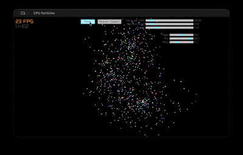

# rayLorenz-Attractor



## Overview

Minimal C project to explore shaders, focusing on the Lorenz Attractor as a live particle system.
Uses custom-compiled [raylib](https://www.raylib.com/) with Google ANGLE backend (OpenGL ES 2.0), cross-platform potential.

**Current:** All particles step & drawn on CPU, real-time controls for system params, GUI via raygui.  
**Next:** Move simulation & draw to GPU shaders (GLSL/ESSL).

## Features

- Lorenz attractor simulation with adjustable parameters
- 3D camera (orbit, preset target)
- Fast particle update & draw (CPU for now)
- GUI sliders/buttons for parameter control (raygui)
- Pure C, no external runtime deps
- Custom IMGUI/layout system: [clay](https://github.com/robloach/clay), integrated with raylib

## Build/Run

### Prereqs

- macOS (tested; Linux/Win should work with OpenGL ES 2.0 & ANGLE, may need build tweaks)
- `gcc` (or clang), C99 compatible
- Raylib static/dynamic libs for OpenGL ES 2.0 backend (+ ANGLE: libEGL, libGLESv2)

### Steps

```bash
# One time: build the tiny build system
cc -o nob nob.c

# Build project (and re-copy required libs)
./nob

# Run
./build/main_cpu
```

This will:
- Create `build/`
- Copy `libEGL.dylib`, `libGLESv2.dylib` to build dir
- Compile `main_cpu.c` with all needed includes, links, and defines
- Output binary: `build/main_cpu`

**Note:** Build scripts use aggressive optimization (`-O3`), OpenGL ES 2.0 defines, and macOS frameworks if on Mac.

## Code Structure

- `src/main_cpu.c` — Main app: CPU particle system, camera, GUI, sim logic
- `include/clay/` — Custom UI/layout engine (see `clay.h` for API)
- `clay_renderer_raylib.c` — Renders UI using raylib
- `include/raylib/`, `raymath.h`, `raygui.h`, `rlgl.h` — raylib core and extras
- `nob.[ch]` — Tiny, self-rebuilding build/config script

## Dependencies

- [raylib](https://www.raylib.com/) (custom built, OpenGL ES 2.0 via ANGLE)
- [Google ANGLE](https://github.com/google/angle) (for cross-platform OpenGL ES)
- [clay](https://github.com/robloach/clay) (UI/layout, C99 single-header)
- [raygui](https://github.com/raysan5/raygui) (immediate mode GUI, bundled)
- Standard C (C99+)

## Implementation Highlights

- All update/draw on CPU (`main_cpu.c`), pure C, minimal allocations
- Custom build: handles include paths, links OpenGL ES 2.0 backend, copies required ANGLE libs
- `clay` enables advanced layout, but usage here is minimal/simple
- Next dev step: port sim and/or draw to GPU via GLSL shaders

## Next Steps / Roadmap

- [ ] Step and render particles on GPU (using OpenGL ES shaders)
- [ ] Benchmarks: CPU vs GPU
- [ ] More parametrized chaos systems

## References

- [GPU particles in raylib](https://github.com/arceryz/raylib-gpu-particles/tree/master)
- [Lorenz Attractor](https://en.wikipedia.org/wiki/Lorenz_system)
- [OpenGL ES 2.0](https://www.khronos.org/opengles/2_X/)
- [Google ANGLE project](https://github.com/google/angle)
